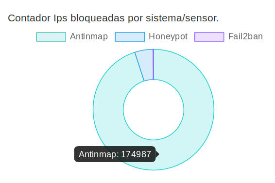

# Hardening-AntinMapBufS


En este scritpt de solo **32 lineas** presento un antiNmap (Deteccion de Escaneos) que combinado con un Banneo (bloqueo de ip a nivel de cortafuegos). Nos va ha permitir parar/bloquear muchos ataques incluso antes de que se produzcan.

Hardening o endurecimiento es el proceso de asegurar un sistema reduciendo sus vulnerabilidades o agujeros de seguridad.

Explicacion: en el caso de los servidores una buena tactica de defensa es anticiparse a los ataques. Bloqueando al atacante incluso antes de que se inicie dicho ataque.

Como: casi todo ataque va precedido de una deteccion/escaner. 
En este caso usamos el comando **tcpdump** para detectar escaneos detectando y analizando todos los paquetes entrantes. despues de un filtro detecto toda actividad **anomala**. 

Ej: si una ip trata de conectarse al servicio VNC 
(si yo no tengo VNC que hace un parquete intentando conectarse.....) entonces obtengo la ip origen y se la paso al cortafuegos y la bloqueo.

La ventaja de este script respecto del AntinMap sencillo
es que bloquea por si solo las ips Atacantes (sin necesidad de terceros programas).
Para ello implemente un buffer (para no saturar la memoria del cortafuegos) y voy bloqueando las ips atacantes.

Este script dada su sencillez lo he licenciado bajo Licencia MIT (la mas permisiva) Luego podras usarlo , modificarlo incluso a nivel privado.

https://es.wikipedia.org/wiki/Licencia_MIT

https://choosealicense.com/licenses/mit/

Estadisticas reales de los bloqueos realizados por el script en 5VPS
(ver http://node.jejo.pw/honeymap).



En el momento de la captura el Antinmap ha bloqueado **175 000 ataques** 

Luego este sistema bloquea bloquea por si solo el **95%** de los ataques.

Estoy preparando una version mas elaborada en la que
alarga el tiempo de bloqueo de las ips que atacan varias veces a la maquina.
Ademas de implementar bloqueo por zona. (si el atacante cambia de ip le seguira bloqueando)

En un futuro articulo presentare una defensa muy superior y mas elaborada que detectara ataques incluso sin abrir los puertos. esta defensa bloquea el **99,9911** de los ataque recibidos.


Codigo. (version1)
```
#!/usr/bin/python
import os
print 'Antinmap detecta y bannea(bloquea) ips que intentan escanear este servidor.' #puertos registrados 1-49151

filtro_pcap  = '"inbound and dst portrange 1-31000 and dst port not 22 and dst port not 80 and dst port not 443 and dst port not 10519"'
#filtro_pcap = '"ip and inbound and (dst portrange 1-79 or dst portrange 81-442 or dst portrange 444-27300)"'
nips         = 256
buffer_ips   = [None for i in xrange(nips)]
lista_blanca = ['8.8.8.8','1.1.1.1','10.8.0.19']
cmd_banip    = 'iptables -A INPUT -j DROP -s ' #+ip_mala  # -A append pongo la regla al final
#cmd_banip    = 'iptables -I INPUT 6 -j DROP -s '#+ip_mala  # -I 6 en algunos sistemas hay que insertar las reglas al principio linea 6
cmd_unbanip  = 'iptables -D INPUT -j DROP -s ' #desbloqueo IP

#debug: print 'tcpdump -c1 -nn -l -s64 '+filtro_pcap

while True:
    tcpdump=os.popen('tcpdump -c1 -nn -l -s64 '+filtro_pcap+' 2>/dev/null').read()
    #debug: print tcpdump #tcpdump contiene la informacion en bruto del paquete capturado

    try:
    	ip_mala=tcpdump.split(' ')[2].split('.') #la ip esta en la 3palabra[2] desde el principio
    	ip_mala=ip_mala[0]+"."+ip_mala[1]+"."+ip_mala[2]+"."+ip_mala[3] #recompongo(quitando ultimo bloque .XXXX)
    	puerto = tcpdump.split('.')[9].split(']')[0].replace(' ','').replace('Flags[','').replace('|','')[:15]
	print "\nip :",ip_mala,"puerto:",puerto

	if ip_mala in lista_blanca: continue #si la ip esta autorizada continua sin bannearla
	if ip_mala in buffer_ips:   continue #si la ip ya esta banneada continuo

	print "ip_mala:",ip_mala,"puerto:",puerto,"  ",tcpdump
	buffer_ips.append(ip_mala)
	os.system( cmd_banip + ip_mala )

    	ip_out = buffer_ips.pop(0) # saco ip mas antigua del buffer
    	if (ip_out != None):
	    print "Lista llena saco una ip: ip_out=",ip_out 
	    os.system("iptables -D INPUT -s " + ip_out + " -j DROP ") #desbloqueo IP
	    os.system( cmd_unbanip + ip_out ) #desbloqueo IP

    except Exception as e:  #except:
    	print "Ups algo a pasado(error)! ",e,"\ntcpdump:",tcpdump
print 'Fin programa!'

```
